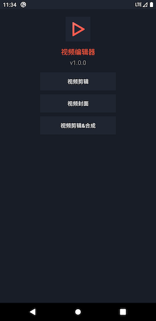
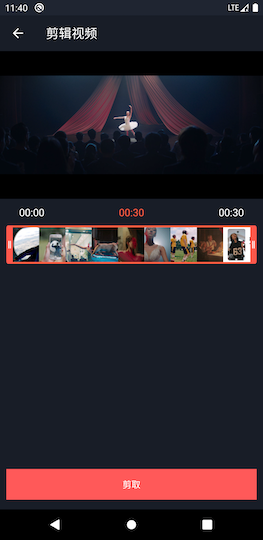

# VideoEditor
 

## FFmpeg编译环境

1. FFmpeg-3.4.4
2. NDK=android-ndk-r17b
3. Mac OS 10.15.2 

## 参考项目

1. [EpMedia](https://github.com/yangjie10930/EpMedia)
2. [EpMediaDemo](https://github.com/yangjie10930/EpMediaDemo)
3. [UGSVSDK](https://github.com/tencentyun/UGSVSDK)
4. [阿里云短视频SDK](https://help.aliyun.com/document_detail/53407.html?spm=a2c4g.11186623.6.1093.4cf023cft2fkKS)

## 参考文章

1. [FFMpeg无损合并视频的多种方法](https://www.jianshu.com/p/a9bccc12229b)
2. [Android ffmpeg调试信息打印在logcat里](https://blog.csdn.net/u012027644/article/details/56666608)
3. [FFmpeg给视频添加水印](https://blog.csdn.net/lovelovelovelovelo/article/details/101457105)
4. [ffmpeg-给视频添加水印常用命令](https://www.jianshu.com/p/9b3375c2e2c1)
5. [ffmpeg —— 添加水印](https://www.cnblogs.com/zxqstrong/p/4595413.html)
